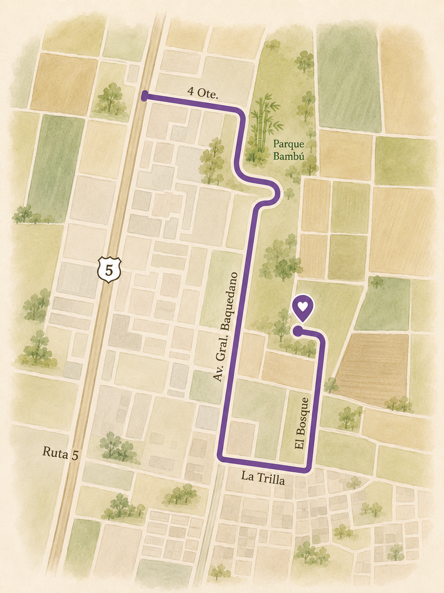

# Invitación Christopher & Viviana

Archivos para subir a la raíz de GitHub Pages:

- `index.html`
- `styles.css`
- `script.js`
- `portada-invitacion.png`
- `.nojekyll`

## Cambios de esta versión

- Header en columna: título arriba, botones debajo, fotos debajo.
- Coordenadas sin iframe de Google Maps: queda solo el link y un bloque para reemplazar por un mapa dibujado.
- Lista de regalos en tarjetas, manteniendo el concepto de cantidad + precio + total, pero con el estilo visual de la página.

## Editar clave

En `script.js`:

```js
const PASSWORD = "matrimonio2027";
```

## Editar Google Forms

En `script.js`:

```js
const RSVP_FORM_URL = "https://forms.gle/REEMPLAZAR_CON_TU_FORM";
```

## Editar regalos y precios

En `script.js`, edita el arreglo:

```js
const gifts = [
  { name: "Nombre del regalo", price: 50.00 }
];
```

Los precios están en USD.

## Editar opciones de transferencia

En `index.html`, busca `Opciones de transferencia` y reemplaza los textos `Completar`.

## Reemplazar el mapa dibujado

En `index.html`, busca `map-placeholder`. Cuando tengan la imagen, pueden reemplazar ese bloque por algo como:

```html

```

y subir también `mapa.png` al repo.
